# Configurable candidate pipeline

Configured `pipeline` mode turns one pinned `five-source-ingest-v2` pool into
an exact attempted-candidate roster, advances each registered task through the
existing stage graph, and exports only candidates whose current evidence passes
every local EL/T prerequisite. `candidate_count` sets the number of attempted
TaskIR candidates, not the number accepted or exported. The orchestrator does
not draw replacements.

## Flow and milestones

```mermaid
flowchart LR
    P[Pinned five-source v2 pool] --> S[Seeded selector<br/>exact N-attempt roster]
    S --> I[Intake + immutable provenance]
    I --> C0[Pre-contamination]
    C0 --> G[Persist 5 populations]
    G --> R[Execute reference<br/>freeze private gold]
    R --> A[Tool-using author]
    A --> V[Independent reviews]
    V --> X[Executed attacks]
    X --> Q[Task-integrity gate]
    Q --> EL[Independent EL acceptance]
    EL --> T[Independent T acceptance]
    T --> L{Current local evidence?}
    L -->|yes| E[Verified local package]
    L -->|reject/fail/block| O[Precise retained outcome]
    T -. optional .-> D[Empirical calibration]
    D -. optional .-> C1[Post-contamination]
    C1 -. optional .-> Z[Selection + audit + release]
    Z -. separate operator process .-> RC[Real-runtime certification<br/>certified difficulty]
```



The profiles define different evidence boundaries:

| Profile | Required outcome |
| --- | --- |
| `draft` | selected TaskIR, typed intake, and source provenance only |
| `local-ready` | all stages through independent EL and T acceptance |
| `packaged` | local-ready plus a standalone verified public/private package |
| `calibrated` | local-ready plus a current empirical solver campaign |
| `release-ready` | calibrated, post-contamination, selection, and audit |
| `release` | release-ready plus a verified immutable corpus release |

Real Airbyte/warehouse/dbt runtime certification is a separate,
operator-triggered lifecycle. A local run does not start cloud resources or
produce a runtime-certified label from mocks or DuckDB alone.

## One-command local evaluator preparation

Copy and edit the example config, especially its approved budgets, provider
routing, admission record, and output directory. The source pool must retain
the exact selector, revision, artifact digests, adapter digest, catalog digest,
generator-tree digest, and lock digest recorded by the v2 contract.

```bash
ET=.venv/bin/elt-taskgen
POOL=runs/generated_50_2026-09-07.ingest.yaml
WS=/secure/runs/candidate-7
RUN=/secure/config/candidate-7.yaml

cp config/generation_run.example.yaml "$RUN"
# Review/edit $RUN before allowing provider calls.
$ET pipeline --workspace "$WS" --ingest-manifest "$POOL" --run-config "$RUN"
```

The shipped routing uses Anthropic for semantic authoring/review roles and the
configured non-Anthropic `openai_compat` route for independent EL/T witnesses.
The cross-family gate validates the real model family and endpoint; renaming an
Anthropic route does not satisfy independence. Bounded tool-using author,
critic, witness, and repair sessions are enabled by role configuration.
`--no-repair-proposer` is the explicit proposer opt-out.

The semantic-author view contains a public, deterministic requirements block
projected from the current `TaskIR`/`MartSpec`: every mart's output grain,
relationships, carried fields, measures, filters, ordering/tie rules, and
`no_activity` behavior. Conditions expose only parsed public identifiers and
literal specification values—not raw predicates, operators, relation aliases,
or SQL. The author must cover that block in public prose, and a separate
deterministic validator checks the submitted prose against the same public
requirements. Both author inputs exclude reference SQL, frozen gold, and
private answers.

Actionable ambiguity/adversary findings use a typed critic-to-attack handoff.
On the active provider wire, every finding has an explicit nullable
`proposed_case`; an executable case contains exactly `kind`, JSON-string
`params`, complete `expected_pass_by_stage.extract_load` and `.transform` maps,
and `rationale`.
Legacy combined-only expectations, object-valued `params`, extra fields, and
truncated or stringified arrays are rejected as protocol errors. Every
non-informational finding from the population
adversary or shortcut attacker must provide that complete case unless it is an
ambiguity/reference dispute. Such disputes always request review/adjudication,
even if the critic also supplied an attack. Missing or malformed handoffs are
`protocol_failure` blocks with an evidence digest, not task-quality rejections.
An INFO-only/silent shortcut seat and a missing or drifted review-transcript
manifest are likewise retry-guarded protocol failures; neither can trigger an
adjudication or task-quality verdict from uncertified critic evidence.

Before execution, the attack compiler validates kind, variant, target,
operation, and parameters against the current task. The allowed kind/variant
contract in the prompt and response schema is derived from the same attack
registry used by the compiler. Named variants and all realized target marts
must agree with the finding text; `add_dedup` requires `custom`,
`remove_dedup` requires `no_dedup`, and `hardcode_population` requires
`constants`. The compiler does not rewrite the requested kind or select an
undeclared variant. SQL emitted by population materialization, references,
attack mutations, evaluation, and exported evaluator SQL quotes identifiers
consistently, including reserved names such as `group`.

Only the candidate count is required. Every other setting has a default that
matches the completed packaged runs, so the shortest complete command is:

```bash
$ET pipeline --candidate-count 10
```

Defaults in candidate-count mode:

| Setting | Default |
| --- | --- |
| `--workspace` | `./runs/default` |
| `--ingest-manifest` | `config/candidate_pool.ingest.yaml`, repinned in place when the installed generator has moved (operator-supplied manifests remain unchanged) |
| `--bench-root` | `$ELT_BENCH_ROOT`, else the `ELT-Bench` checkout beside this repository; records contamination measurement when the workspace has none |
| `--readiness-profile` | `packaged` |
| `--destination` | `all` (snowflake at the bundle root; databricks and redshift under `destinations/<name>/`) |
| `--export-dir` | `<workspace>/packages` |
| `--admission-reference` | `$ELT_TASKGEN_ADMISSION`, else `council/state/council.live_admitted` |
| `--seed` | `0`; `--source-families` all five, balanced allocation |
| `--workers` | `4` |
| `--max-repair-rounds` / `--repair-attempts` | `3` / `config/agents.yaml repair.max_attempts` |
| `--repair-proposer` / `--repair-proposer-mode` | on / `bounded` |
| `--budget-per-task` / `--budget-total` | `25.00` / `40.00` per requested candidate |
| `--agents-config` | packaged `config/agents.yaml` |
| `--http-retries` / `--schema-retries` / `--http-timeout-seconds` / `--http-backoff-seconds` | `4` / `2` / `600` / `2` |

For a small CLI-only run that states every material choice:

```bash
$ET pipeline --workspace /secure/runs/candidate-2 \
  --ingest-manifest "$POOL" \
  --candidate-count 2 \
  --source-families synsql,wikidbs \
  --source-allocation synsql=1,wikidbs=1 \
  --seed 41 \
  --readiness-profile packaged \
  --export-dir /secure/runs/candidate-2/packages \
  --agents-config /secure/config/agents.yaml \
  --admission-reference /secure/council/admission.json \
  --workers 2 --max-repair-rounds 2 --repair-attempts 2 \
  --http-retries 4 --schema-retries 2 \
  --http-timeout-seconds 600 --http-backoff-seconds 2 \
  --budget-per-task 7 --budget-total 14
```

Balanced allocation supports N smaller than five and does not force every
origin into a small run. An explicit allocation must name only selected
families, contain non-negative integers, and sum to N; an impossible quota is
rejected before intake or provider construction.

## Headless coding-agent harnesses

Two provider kinds run a tool-session role through a coding-agent harness
instead of the direct API transport: `claude_headless` (Claude Code through
the Claude Agent SDK) and `codex_headless` (Codex through its app-server
SDK). Install them with the `headless` extra:

```bash
uv sync --extra headless   # or: uv pip install --python .venv/bin/python -e ".[headless]"
```

The bounded session state machine remains the runner. The harness supplies
only model turns: it sees no built-in tool and no project
configuration, the only tools on its wire are the role's own tools running
in this process against the held trial copy, every call is still permitted,
capped, recorded and hash-chained by the runner, and usage is priced by the
rate card in `config/agents.yaml`, not by the harness's estimate.
Recorded turns replay from the transcript store under `--replay-only`
exactly as API turns do; the harness is not started during replay.

Use `--agent-harness headless` (or
`ELT_TASKGEN_AGENT_HARNESS=headless`) routes every agentic role, one that
runs a tool session, to a harness: the author and the repair proposer run
through Claude Code, and the implementer and loader run through Codex. The
one-shot seats, the four council critics and audit triage, stay on the API
in both modes. A critic does not call a tool; it answers one forced,
strict-schema `report_findings` call, which the API sends and a coding-agent
harness cannot. `--agent-harness api` pins the direct transports. The flag
sets the two provider-family variables `config/agents.yaml` reads
(`ELT_TASKGEN_CLAUDE_PROVIDER`, `ELT_TASKGEN_OSS_PROVIDER`), so a routing
document read after it resolves to that mode. A configured run records the
mode in its spec and every provider stage's inputs, and a resumed run keeps
its mode whatever the shell says.

Council seats do not follow the switch, so both modes consult
`council/state/council.live_admitted`
(`$ELT_TASKGEN_ADMISSION` overrides it), and no separate headless metrology
is needed. A headless run is:

```bash
elt-taskgen pipeline --candidate-count 10 --agent-harness headless
```

The witness roles take their model from the provider block when they leave
`model` empty (`ELT_TASKGEN_WITNESS_MODEL` and `ELT_TASKGEN_LOADER_MODEL`
override it). Codex uses the CLI's saved login (`codex login`) unless
`CODEX_API_KEY` is set; Claude Code uses `ANTHROPIC_API_KEY`. Each provider
block pins `cli_version`; a binary that reports another version is refused.
Each block also declares `max_tokens`, the per-step output ceiling the
reserve estimate assumes for that harness, which clamps a role's larger
declaration on that provider. The calibration solver roster measures
difficulty with specific API models and does not follow the switch.

## Draft, resume, status, and package verification

Draft-only generation does no provider work:

```bash
$ET pipeline --workspace /secure/runs/draft-1 \
  --ingest-manifest "$POOL" --candidate-count 1 \
  --source-families dlt --source-allocation dlt=1 \
  --seed 41 --readiness-profile draft --run-id draft-1
```

Resume by repeating the identical command. The default run id is derived from
the typed configuration and selected roster; an explicit `--run-id` cannot be
reused for a different run identity. `--no-resume` refuses existing candidates.
`--reingest` is only for a deliberate changed source identity and cannot be
combined with `--no-resume`.

If a corrected role surface makes council admission stale, fresh metrology for
an existing recovery must have its own explicit aggregate sublimit and may be
bound to the existing parent ledger:

```bash
$ET metrology --workspace /secure/council --workers 4 \
  --budget-per-task 60 --budget-total 60 \
  --parent-budget-workspace /secure/runs/candidate-2 \
  --parent-budget-run-id <existing-run-id> --parent-budget-total 350
```

The parent ledger is opened in aggregate-only mode for the non-candidate
`council-metrology` account. Candidate workers still enforce their immutable
per-candidate limit, while both metrology and recovery calls reserve atomically
against the same parent total. The three parent flags and the metrology
`--budget-total` are all required; these flags enforce budgets but do not grant
authorization.

An implementation-only `--reingest` is accepted only when an off-workspace
rebuild proves that every selected source/revision/artifact/license pin and
every TaskIR intake identity is unchanged. The only permitted manifest changes
are the generator identity and explicit adapter version/digest transitions.
The coordinator binds each adapter transition to both old and new source-entry
digests, rederives the complete roster, and refuses the migration if even one
TaskIR root changes. It then commits a content-addressed authorization,
all-roster equivalence record, and immutable migration receipt before moving
the active implementation head. Generator-only v1 records remain readable;
new adapter-aware records use the v2 contract.

This path does not edit a TaskIR, create a replacement candidate, or relabel
the original provenance claim. A genuine adapter semantic change must instead
cross the ordinary explicit new-lineage re-ingest boundary, which makes prior
stage evidence stale. Chained implementation migrations verify historical
receipts at the archived TaskIR identity. That integrity check does not
reactivate a superseded report: prompt, validator, role behavior, adapter
code, or stage-seal drift still leaves the current stage `STALE`, and the stage
must be genuinely rerun before admission or packaging.

```bash
$ET pipeline --workspace /secure/runs/candidate-2 \
  --ingest-manifest "$POOL" --run-config /secure/config/candidate-2.yaml
$ET pipeline-status --workspace /secure/runs/candidate-2 \
  --run-id <reported-run-id>
$ET verify-local-package \
  --package /secure/runs/candidate-2/packages/<accepted-task-id>
```

`pipeline-status` is read-only. It revalidates current task identities, stage
artifacts, configuration seals, and package bytes; an old PASS row does not
override deleted populations, stale gold, changed role configuration, changed
stage implementation, or a tampered package. Configured stage seals include a
closed, stage-specific contract: the current `role_behavior_sha256` for every
provider role whose output the stage creates or consumes, plus source digests
for the prompt/schema validators, attack/compiler path, execution path, and
runtime scorer relevant to that stage. Changing any of those inputs changes the
expected content-addressed seal and reports the old PASS as `STALE`; it cannot
be adopted into a package until the stage is genuinely rerun and resealed.
The author ledger payload also binds the exact semantic-author behavior, and
each review-manifest row plus its transcript route binds the critic behavior,
tool schema, session policy, and diagnostics version. Therefore direct stage
readiness checks (not only configured coordinator runs) reject prompt or
protocol drift as stale evidence.

For `packaged` resumes, a task is adopted without provider work only when its
canonical package and canonical fresh-copy receipt validate against the current
TaskIR, accepted ledger state, all configured stage seals through independent
T acceptance, and current evaluator runtime. Adopted rows remain in the frozen
roster with `state=packaged` and zero new cost; only pending rows enter provider
preflight and worker dispatch. A byte-intact historical package whose generator
or evaluator identity changed is stale evidence, not an adopted package.

The historical `--size` option remains a post-preparation corpus-selection
quota. It is intentionally incompatible with configured `candidate_count`
mode, so existing scripts retain their current meaning.

## Durable evidence and failure semantics

Every run writes the complete machine-readable roster to:

```text
<workspace>/state/pipeline_runs/<run-id>/readiness.json
```

Registered tasks also receive `tasks/<task-id>/reports/readiness.json`.
Candidates that fail before TaskIR creation are recorded under the run's
`candidates/` directory rather than task directories. Immutable per-worker
attempt records live under `attempts/<task-id>/`; an unfinished `RUNNING`
attempt becomes `INTERRUPTED` on resume and remains in history.

The report separately counts requested attempts, generated candidates,
locally accepted tasks, exported tasks, rejected candidates, failed candidates,
and blocked candidates. Population/table/mart/attack coverage is derived from
each actual TaskIR. Stage states are `NOT_RUN`, `RUNNING`, `PASS`, `FAIL`,
`BLOCKED`, or `STALE`, with evidence paths and precise reasons. Failure causes
are also typed as `quality_rejection`, `infrastructure_failure`,
`protocol_failure`, `pending_adjudication`, `operational_blocking`, or
`stale_evidence`; these classes are dispositions, not aliases for rejection.

Candidate-local adapter, provider, validation, rejection, and package failures
do not discard successful siblings. Global generator/catalog integrity,
admission, or shared-budget failures stop only work that cannot proceed safely.
The SQLite WAL budget ledger makes conservative prospective reservations across
all concurrent workers and preserves uncertain in-flight charges on resume.
Transport retries are bounded; semantic failure and repair are separate,
versioned, bounded events.

An unchanged protocol failure or pending-adjudication record carries an
explicit retry guard, so an ordinary resume does not poll the same provider or
repeat the same deterministic failure. Recovery must be explicit and
append-only: replace/correct the handoff, record a bound adjudication or a new
independent build, revise/reingest the TaskIR, or use the supported `--re-emit`
path after the prerequisite changes. Historical attempts, revisions, costs,
and invalidations remain in the ledger; changed task content or generator,
prompt, routing, attack, comparator, or evaluator identity makes its dependent
evidence stale.

Historical fatal rows that are now known to represent a protocol or harness
defect use the closed, provider-free two-phase recovery command. `prepare`
validates the exact task hash, cause/target report payloads, observations, and
current fixed-code digests, then writes content-addressed evidence without
touching the ledger. `apply` is a separate operator decision and can append
only the certified non-PASS disposition (`FAIL` for stale evidence or
`BLOCKED` for pending adjudication); it cannot append `PASS`:

```bash
PYTHONPATH=src .venv/bin/python -m elt_taskgen.offline_recovery prepare \
  --workspace /secure/runs/candidate-2 --request /secure/recovery/request.json
PYTHONPATH=src .venv/bin/python -m elt_taskgen.offline_recovery apply \
  --workspace /secure/runs/candidate-2 \
  --evidence state/fatal-recovery-evidence/<sha256>.json
```

Requests use a closed recovery-kind roster, and application refuses drift in
the task, report payloads, observations, revalidator, or fixed code. Preparing
evidence does not authorize `apply`, a repair, provider work, metrology, or a
retry; those remain separately authorized operations.

An incomplete historical author draft uses
`author_instruction_regeneration_v1`. Its analyzer requires the exact red
draft and fatal, confirms that the old prose is still incomplete, and binds the
current TaskIR-derived author view, semantic-author prompt, and independent
coverage checker. Applying it appends `FAIL/stale_evidence`; it does not approve
the old prose. A resumed author stage must generate a new draft and obtain a
fresh deterministic coverage pass.

For a recorded independent-gold disagreement, produce a private, bounded
row-level diagnostic without changing gold:

```bash
PYTHONPATH=src .venv/bin/python -m elt_taskgen.reference.adjudication \
  --workspace /secure/runs/candidate-2 \
  --task-id <task-id> --max-differences-per-mart 25
```

The content-addressed audit binds the current TaskIR, independent-build record,
gold manifest, and witness SQL digests. It identifies mismatching populations,
marts, and grain-keyed rows while keeping SQL and private row values out of
stdout. The gate remains `pending_adjudication` until a bound decision or a new
independent build resolves it; the diagnostic does not decide the dispute.

After reducing the row differences against the public specification, an
operator may record a typed engineering diagnosis without clearing that hold:

```bash
PYTHONPATH=src .venv/bin/python -m elt_taskgen.reference.adjudication \
  --workspace /secure/runs/candidate-2 --task-id <task-id> \
  --max-differences-per-mart 25 --determined-cause witness \
  --determination-basis '<bounded explanation tied to the public rules>'
```

The content-addressed diagnosis sidecar binds the exact row-level analysis and
sets `gate_effect=none`; it does not overwrite reference, witness, data, or gold,
and formal adjudication remains pending.

When that investigation determines that the witness is wrong, an explicit
operator may bind the diagnosis and authorize exactly one fresh blind witness
attempt:

```bash
PYTHONPATH=src .venv/bin/python -m elt_taskgen.reference.adjudication \
  --workspace /secure/runs/candidate-2 --task-id <task-id> \
  --max-differences-per-mart 25 --determined-cause witness \
  --determination-basis '<public-rule and hand-fixture justification>' \
  --adjudicate-witness-error --adjudicator '<operator identity>'
```

The resulting `dual_build_decision.<sha256>.json` is private,
content-addressed, and bound to the exact TaskIR, disputed witness, gold
manifest, analysis, and diagnosis. It has
`gate_effect=authorize_fresh_build_only`: it cannot pass a gate, edit gold, or
patch witness SQL. The next normal gates execution uses a value-free recovery
generation to obtain a separately keyed build from the public bundle only.
Replacing the witness archives its previous bytes and makes the decision stale.
A second retry requires a new row-level analysis and decision.

To recover a historical fatal after that decision, prepare and apply the
closed `independent_witness_error_adjudicated_v1` recovery kind with exactly
the current build, gold manifest, analysis, diagnosis, and decision as its
observations. The analyzer revalidates every byte binding and appends only
`FAIL/stale_evidence`, making `gates` the normal resume point. Unresolved cases
continue to use `independent_gold_disagreement_pending_v1`, which appends a
guarded `BLOCKED/pending_adjudication` instead. Neither transition records a
PASS; only the subsequently executed blind build and normal gates can do so.

## Empirical and runtime-certified difficulty

`calibrated`, `release-ready`, and `release` require `empirical: true` and a
current configured solver campaign. Solver results measure difficulty; they do
not rewrite or invalidate a semantically valid task.

After a certified release, a qualified operator uses the existing
`runtime certification` lifecycle and `runtime certify-difficulty` commands
described in [the warehouse runbook](WAREHOUSE_CONNECTORS.md). Runtime-certified
difficulty is valid only when the release, both strict runtime stages, closed
population roster, cleanup lifecycle, empirical campaign, and sealed difficulty
report all verify. Until then, readiness reports say it is not certified.

For read-only reporting, a `release` profile may set both
`runtime_certification_store` and `runtime_difficulty_reports` (an exact
task-id-to-report-path map). `pipeline-status` reconstructs and verifies the
completed lifecycle and difficulty evidence without provisioning anything.
Missing, changed, or mismatched evidence returns a nonzero status and remains
distinct from local evaluator readiness.

## Canonical solution reachability

A packaged task is graded on the RLVR workspace channel through two closed
policies: the solver's `elt/main.tf` must compile to the private Airbyte
intent graph, and every dbt model must fit the portable dbt subset
(`portable-dbt-sql-v3`). The reference implementation and the independent
witness are DuckDB SQL, so neither exercises those policies. The transform
battery therefore carries a task-level `canonical-reachability` gate. The
validate-t runner derives the canonical Terraform + dbt project mechanically
from the private connector contract and the reference SQL
(`training/canonical.py`), scores it through `training.scorer.score_workspace`
on every graded population, and records the result at
`tasks/<task_id>/reports/canonical_reachability.json`, with the artifact under
`answer_key/runtime/canonical/<destination>/`. The record is bound to the task
identity, the reference SQL, the connector contract, the subset and scorer
versions, and the artifact bytes.

This check does not reject tasks:

| Outcome | Stage result |
|---|---|
| Reward 1.0 on every graded population | the gate passes |
| A measured shortfall, or a shape the emitter cannot render, as the only failing gate | BLOCKED for a pipeline change (`canonical_workspace_unreachable`); each re-run re-scores |
| The dbt runtime is missing, the workspace cannot be laid out, the grader reports a harness, infrastructure or real-runtime failure, or the reference times out | BLOCKED on the environment, no record written |
| The grader refuses the exported task package | BLOCKED for a human (`canonical_task_package_invalid`) |

Local packaging (`verify_local_package`) and the release freezer both refuse
a task whose record is missing, stale or unreachable, and the fresh-copy
package verification re-scores the packaged artifact
(`canonical_workspace_reachable`, required for a verified receipt). A
same-identity re-export keeps the artifact; a re-export that changes the
connector contract leaves a stale record that all three refuse. Packages are
immutable: after fixing the cause, run validate-t again and remove the stale
package directory before freezing.

The check runs on DuckDB only and needs the pinned dbt runtime. A configured
run past the draft profile refuses at preflight without it:

```bash
uv sync --project runtime-images/dbt-duckdb --locked
```

Budget roughly 30 to 60 seconds per task on validate-t and the same again at
packaging. The grader's dbt session runs with `TimeZone=UTC`.

### Real-destination evidence

Every rule in the portable dbt subset asserts agreement between a real
warehouse and local DuckDB. The 2026-09-16 evidence contains 41 scalar probes
from a live Snowflake account and Databricks SQL warehouse, plus the same
grader-rewritten expressions on pinned DuckDB. The evidence, probe matrix, and
collector are in `tests/fixtures/warehouse_differential/`, and
`tests/test_warehouse_differential.py` binds the policy to it without needing
any warehouse.

The measurement produced these `portable-dbt-sql-v3` changes:

| Finding | Action |
|---|---|
| Both warehouses fold a sharp S to `SS`; DuckDB keeps the capital sharp S | `UPPER` left the subset |
| Snowflake renders a DOUBLE as `1`, a third as 10 digits and a TIMESTAMP with `.000`; DuckDB renders `1.0`, 17 digits and no suffix | a cast to text over a double or timestamp operand is refused, so no hash or concatenation depends on it |
| Databricks `DATE_TRUNC` of a timestamp returns a TIMESTAMP; the pinned DuckDB returns a DATE | the rewrite casts that result back |
| Databricks `DATEDIFF(hour, ...)` counts whole units, DuckDB counts boundaries | confirmed the existing Snowflake-only rule |
| Redshift `AVG` over integers divides as integers: 1 where the others give 1.5 | `AVG` is refused for that destination |
| Redshift `REGEXP_REPLACE` replaces every match, DuckDB only the first | the rewrite adds the global flag |
| Redshift `DATE_TRUNC` returns a timestamp for every operand, including a date | the rewrite casts that result back |
| Redshift cannot cast a boolean to text at all | such a cast is refused for that destination |
| The sharp S uppercases three different ways: `SS` on Snowflake and Databricks, unchanged on Redshift, capital sharp S on DuckDB | reinforces removing `UPPER` |

INTEGER and DECIMAL text rendering, `MD5`, `||`, `CONCAT`, null propagation,
`DATE_TRUNC` on Snowflake, `EXTRACT`, integer division, `ROUND` to a scale,
guarded division, the aggregates, comparison, `ILIKE`, `REGEXP_REPLACE`,
`SUBSTRING`, `LENGTH`, `TRIM` and `LOWER` all measured identical on both
warehouses.

All three destinations are measured. Redshift serverless cold starts can exceed
the runtime client's fixed 15-second connection bound, and one failed statement
aborts the transaction. The collector therefore enables autocommit and rolls
back between probes. To refresh or extend the evidence:

```bash
uv sync --extra runtime-all --locked
.venv/bin/python tests/fixtures/warehouse_differential/collect.py snowflake
.venv/bin/python tests/fixtures/warehouse_differential/collect.py databricks
.venv/bin/python tests/fixtures/warehouse_differential/collect.py redshift
```
